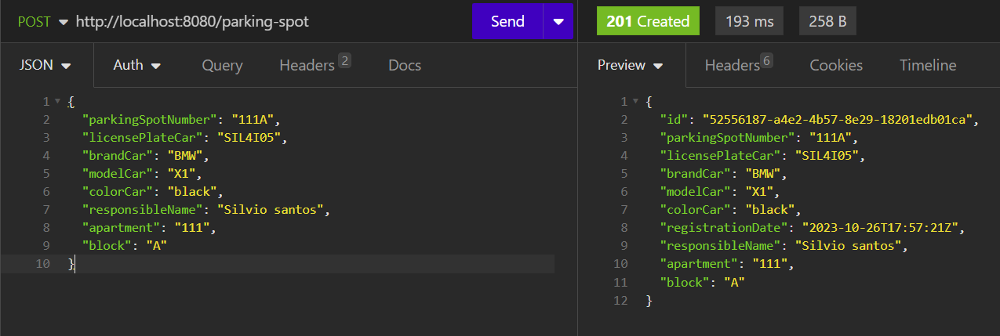
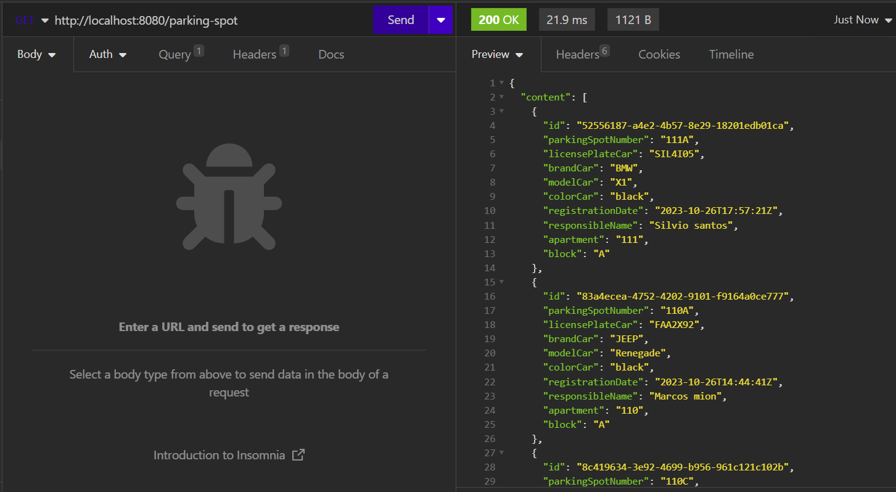
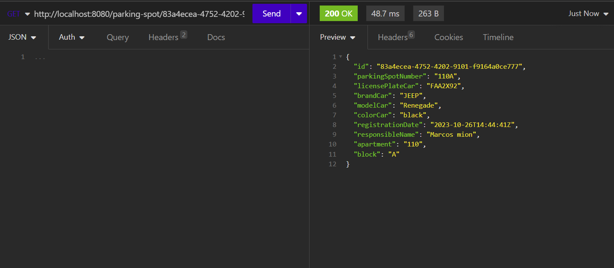
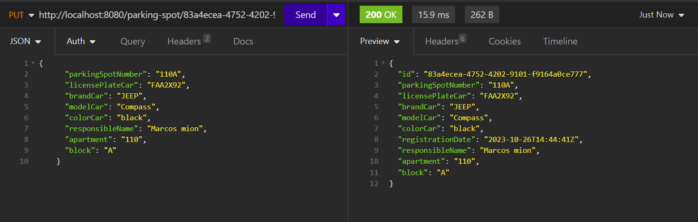
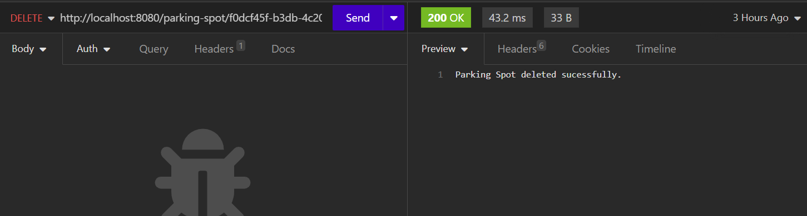

# parking-control-spot

Este documento tem como objetivo descrever as principais informações da aplicação parking control

## Informações gerais

Aplicação visando gerenciar vagas de um estacionamento de um condomínio, como cadastro de uma vaga, busca por todas as vagas disponíveis ou por um `id` especifico, atualização de informações sobre uma determinada vaga e a exclusão de um registro específico.

## Rodar aplicação local

### Variáveis de ambiente:

| Nome        | Descrição                         |
|-------------|-----------------------------------|
| DB_USERNAME | Nome de usuário do banco de dados |
| DB_PASSWORD | Senha banco de dados              |
| DB_URL      | URL do banco de dados             |

* Necessário a criação da base de dados parking_control_db no banco ultilizado.

### Cadastro de uma nova vaga

#### Rota

| Método | URL                                      | Descrição                         |
|--------|------------------------------------------|-----------------------------------|
| POST   | http://localhost:8080/parking-spot       | Cadastro de uma nova vaga         |

#### Entradas:

| Nome campo        | Tipo   | Descrição           |
|-------------------|--------|---------------------|
| parkingSpotNumber | String | Número da vaga      |
| licensePlateCar   | String | Placa do carro      |
| brandCar          | String | Marca do carro      |
| modelCar          | String | Modelo do carro     |
| colorCar          | String | Cor do carro        |
| responsibleName   | String | Nome do responsável |
| apartment         | String | Apartamento         |
| block             | String | bloco               |

#### Saída:

##### Status code 201 Created

| Nome campo        | Tipo   | Descrição                         |
|-------------------|--------|-----------------------------------|
| id                | UUID   | `id` gerado pelo banco            |
| parkingSpotNumber | String | Número da vaga                    |
| licensePlateCar   | String | Placa do carro                    |
| brandCar          | String | Marca do carro                    |
| modelCar          | String | Modelo do carro                   |
| colorCar          | String | Cor do carro                      |
| registrationDate  | String | Horário criação registro no banco |
| responsibleName   | String | Nome do responsável               |
| apartment         | String | Apartamento                       |
| block             | String | bloco                             |

###### Ex:

### Buscas todas as vagas cadastradas

#### Rota

| Método | URL                                      | Descrição                         |
|--------|------------------------------------------|-----------------------------------|
| GET    | http://localhost:8080/parking-spot       | Buscas todas as vagas cadastradas |

#### Saída:
##### Status code 200 OK

###### Ex:

### Busca vaga a partir do ID

#### Rota

| Método | URL                                      | Descrição                         |
|--------|------------------------------------------|-----------------------------------|
| GET    | http://localhost:8080/parking-spot/ `id` | Busca vaga a partir do `id`       |

#### Saída:
##### Status code 200 OK

###### Ex:

### Atualiza registro por ID

#### Rota

| Método | URL                                      | Descrição                         |
|--------|------------------------------------------|-----------------------------------|
| PUT    | http://localhost:8080/parking-spot/ `id` | Atualiza registro por `id`        |  

#### Entradas:

| Nome campo        | Tipo   | Descrição           |
|-------------------|--------|---------------------|
| parkingSpotNumber | String | Número da vaga      |
| licensePlateCar   | String | Placa do carro      |
| brandCar          | String | Marca do carro      |
| modelCar          | String | Modelo do carro     |
| colorCar          | String | Cor do carro        |
| responsibleName   | String | Nome do responsável |
| apartment         | String | Apartamento         |
| block             | String | bloco               |

#### Saída:

##### Status code 200 OK

| Nome campo        | Tipo   | Descrição                         |
|-------------------|--------|-----------------------------------|
| id                | UUID   | `id` gerado pelo banco            |
| parkingSpotNumber | String | Número da vaga atualizado         |
| licensePlateCar   | String | Placa do carro atualizado         |
| brandCar          | String | Marca do carro atualizado         |
| modelCar          | String | Modelo do carro  atualizado       |
| colorCar          | String | Cor do carro atualizado           |
| registrationDate  | String | Horário criação registro no banco |
| responsibleName   | String | Nome do responsável atualizado    |
| apartment         | String | Apartamento atualizado            |
| block             | String | bloco atualizado                  |

###### Ex:

### Atualiza registro por ID

#### Rota

| Método | URL                                      | Descrição                         |
|--------|------------------------------------------|-----------------------------------|
| DELETE | http://localhost:8080/parking-spot/ `id` | Exclui registro por `id`          |

#### Saída:
##### Status code 200
Parking Spot deleted sucessfully.

###### Ex:
